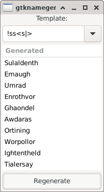

<!--
SPDX-FileCopyrightText: 2021 Jeff Epler

SPDX-License-Identifier: GPL-3.0-only
-->

# namegen: template-based string generator

Inspirations:
 * Rinkworks' [Fantasy Name Generator](http://www.rinkworks.com/namegen/)
 * Skeeto's [Fantasy Name Generator](https://github.com/skeeto/fantasyname/)

The direct template interpretation approach of Skeeto's C implementation is used here.

There's a commandline version, also usable as a library; and a Gtk wrapper.
